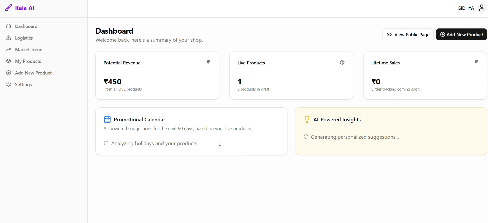
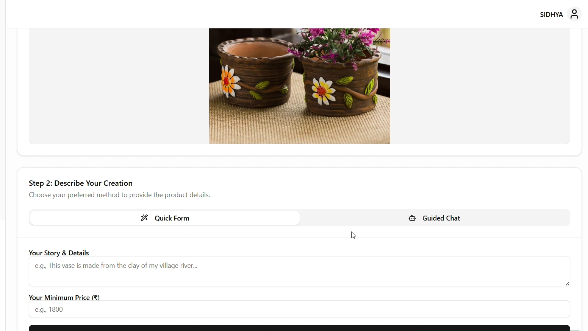
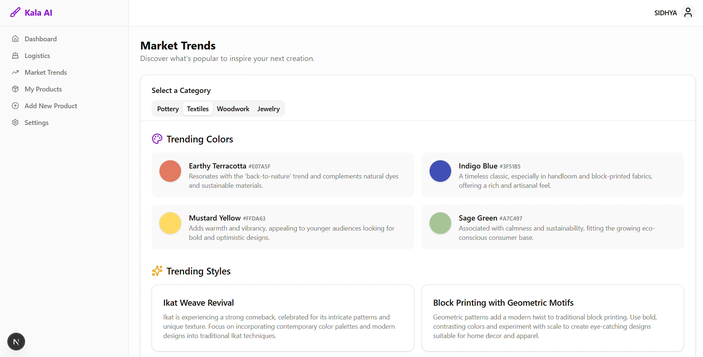
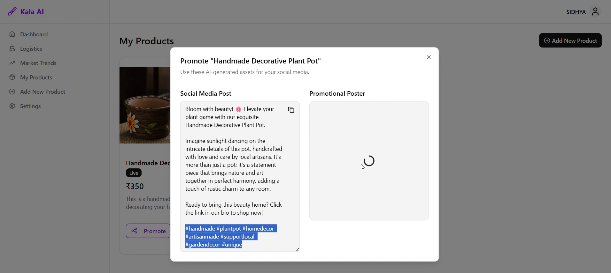
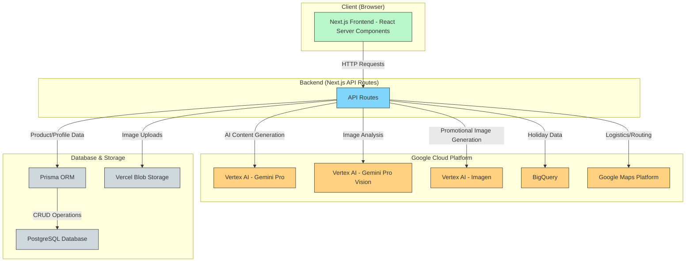

# Kala AI: AI-Powered Marketplace Assistant for Local Artisans

Kala AI is a sophisticated, AI-driven web application designed to empower local artisans by simplifying the complexities of e-commerce. It provides a suite of intelligent tools that handle marketing, product content creation, market analysis, and logistics, allowing creators to focus on their craft. The platform leverages Google Cloud's powerful Vertex AI suite, BigQuery, and Maps Platform to deliver actionable insights and automate tedious tasks.

<br>

## ✨ Core Features

Kala AI is packed with features that leverage multimodal AI to provide a seamless experience for artisans.

### 🎨 AI-Powered Product Management
*   **Multimodal Product Generation:** Upload a product image and provide brief notes, and the AI will generate a marketable title, an SEO-friendly description, relevant tags, a suggested price, photography tips, a dominant color palette, and relevant market insights.
*   **Conversational Product Creation:** Engage with a friendly AI chatbot that guides you through the product creation process step-by-step, making it accessible for non-technical users.
*   **One-Click Marketing Assets:** Instantly generate engaging social media posts (e.g., for Instagram) and create unique promotional posters for any product using generative AI.

### 📈 AI-Driven Market Intelligence
*   **Real-time Market Trend Analysis:** Discover trending colors, styles, and patterns in specific craft categories like Pottery, Textiles, and Jewelry to inspire new creations.
*   **Seasonal Promotional Calendar:** The AI cross-references upcoming holidays in India (via BigQuery public datasets) with your product catalog to provide timely marketing suggestions.
*   **Personalized Actionable Insights:** The dashboard features an AI-powered widget that analyzes your product listings and provides encouraging, actionable tips to improve sales and visibility.

### 🚚 Logistics & Operations
*   **Shipping Route & Cost Optimizer:** An integrated logistics tool, powered by the Google Maps Platform, calculates the optimal shipping route and estimated cost from the artisan's location (pre-set to Jaipur) to any destination in India.

### 🖥️ Artisan Platform & Public Showcase
*   **Modern Artisan Dashboard:** A central hub to view key stats like potential revenue, live product counts, and AI-driven suggestions.
*   **Public Artisan & Product Pages:** Automatically generated, beautifully designed, and SEO-friendly public pages to showcase the artisan's story and products to the world.
*   **Profile Management with AI Bio Generation:** Artisans can provide simple notes about their story and craft, and the AI will write a compelling, professional biography for their public profile.
*   **Internationalization (i18n):** The entire platform supports both English and Hindi to cater to a wider audience of local artisans.

<br>

## 🖼️ Screenshots

## Dashboard Image



## New Product 


## Trends Analysis


## Promotion Page


<br>

## 🏛️ Architecture & Workflow

Kala AI is built on a modern, serverless architecture using Next.js on Vercel. The frontend and backend are tightly integrated within the Next.js App Router paradigm.

### Architecture Diagram



### Typical User Workflow

1.  **Onboarding:** An artisan lands on the page, enters their "workshop," and navigates to the settings page.
2.  **Profile Creation:** They enter their name and some notes about their craft. The application uses Vertex AI to generate a professional biography and saves it to the database.
3.  **Product Creation:**
    *   The artisan clicks "Add New Product."
    *   They upload a photo of their creation, which is stored in Vercel Blob.
    *   They provide a short story and a minimum price.
    *   They click "Generate with AI." The Next.js API route sends the image and text to the **Gemini Pro Vision** model.
    *   The model returns a complete JSON object with a title, description, tags, suggested price, a photography tip, color palette, and market trends.
    *   The artisan reviews and edits the AI-generated content and saves the product as a draft.
4.  **Marketing:**
    *   From the "My Products" page, the artisan publishes the draft, making it LIVE.
    *   They then click the "Promote" button.
    *   The app calls two different API routes: one to **Gemini Pro** to generate a social media post, and another to **Imagen** to create a promotional poster.
5.  **Strategy:**
    *   On the dashboard, the artisan sees a suggestion from the **Promotional Calendar** (powered by BigQuery and Gemini Pro) to market their "Clay Diyas" for the upcoming Diwali festival. This gives them a clear, timely marketing action to take.

<br>

## 🛠️ Tech Stack & Key Libraries

| Category | Technology / Library | Description |
| :--- | :--- | :--- |
| **Framework** | [Next.js](https://nextjs.org/) 15 (App Router) | Full-stack React framework with Server Components and Turbopack. |
| **Language** | [TypeScript](https://www.typescriptlang.org/) | Static typing for robust and scalable code. |
| **Styling** | [Tailwind CSS](https://tailwindcss.com/) v4 | A utility-first CSS framework for rapid UI development. |
| **UI Components**| [shadcn/ui](https://ui.shadcn.com/) | Re-usable components built on Radix UI and Tailwind CSS. |
| **Database ORM**| [Prisma](https://www.prisma.io/) | Next-generation ORM for Node.js and TypeScript. |
| **Database** | [PostgreSQL](https://www.postgresql.org/) | Powerful, open-source object-relational database system. |
| **AI (Text)** | [Vertex AI - Gemini Pro](https://cloud.google.com/vertex-ai) | For all text-based generation (descriptions, suggestions, bios). |
| **AI (Vision)** | [Vertex AI - Gemini Pro Vision](https://cloud.google.com/vertex-ai) | Multimodal model for analyzing product images. |
| **AI (Image)** | [Vertex AI - Imagen](https://cloud.google.com/vertex-ai) | For generating promotional marketing images. |
| **Data Warehouse**| [Google BigQuery](https://cloud.google.com/bigquery) | Used to query public datasets for holiday information. |
| **Mapping** | [Google Maps Platform](https://cloud.google.com/maps-platform) | Powers the Logistics Optimizer for routes and distance calculation. |
| **File Storage** | [Vercel Blob](https://vercel.com/storage/blob) | For easy and secure file uploads and storage. |
| **Icons** | [Lucide React](https://lucide.dev/) | A beautiful and consistent icon library. |
| **Deployment** | [Vercel](https://vercel.com/) | Serverless platform for deploying Next.js applications. |

<br>

## ☁️ Google Cloud Platform Components

| GCP Service | Purpose in Kala AI | API Route Example |
| :--- | :--- | :--- |
| **Vertex AI (Gemini Pro)** | Text generation for bios, suggestions, marketing posts, and trend analysis. | `api/profile/route.ts`, `api/generate-suggestions/route.ts` |
| **Vertex AI (Gemini Pro Vision)** | Multimodal analysis of product images to extract details and generate content. | `api/generate-product-details/route.ts` |
| **Vertex AI (Imagen)** | Text-to-image generation for creating promotional posters. | `api/generate-promo-image/route.ts` |
| **BigQuery** | Querying the `holidays_and_events_for_forecasting` public dataset to find upcoming Indian holidays. | `api/seasonal-suggestions/route.ts` |
| **Google Maps Platform** | Directions API to calculate routes, distance, and duration for logistics. | `api/optimize-route/route.ts` |

<br>

## 🗃️ Database Schema (Prisma)

The data model is simple and effective, focusing on two main entities: `Product` and `ArtisanProfile`.

```prisma
// file: prisma/schema.prisma

generator client {
  provider = "prisma-client-js"
}

datasource db {
  provider  = "postgresql"
  url       = env("POSTGRES_URL")
  directUrl = env("POSTGRES_URL_NON_POOLING")
}

model Product {
  id           String   @id @default(cuid())
  createdAt    DateTime @default(now())
  name         String
  description  String?
  price        Int
  status       String   @default("DRAFT")
  tags         String[]
  imageUrl     String?
  artisanNotes String?
  category     String?
}

model ArtisanProfile {
  id           String   @id @default("main_artisan") // Singleton model for a single-artisan setup
  name         String?
  bio          String?  // AI-generated biography
  profileImage String?
  storyNotes   String?  // Raw notes from the artisan for the AI
  createdAt    DateTime @default(now())
  updatedAt    DateTime @updatedAt
}
```

<br>

## 🚀 Getting Started

To run this project locally, you will need to set up the required environment variables.

### 1. Clone the repository

```bash
git clone https://github.com/sidhyaashu/kala.git
cd kala
```

### 2. Install dependencies

```bash
npm install
```

### 3. Set up environment variables

Create a file named `.env.local` in the root of the project and add the following variables.

```env
# Prisma / Database
POSTGRES_URL="your_postgresql_connection_string"
POSTGRES_URL_NON_POOLING="your_postgresql_non_pooling_connection_string"

# Google Cloud
GOOGLE_PROJECT_ID="your-gcp-project-id"
GOOGLE_CREDENTIALS='your_gcp_service_account_key_json' # Must be a JSON string
GOOGLE_MAPS_API_KEY="your_google_maps_api_key"

# Vercel Blob Storage
BLOB_READ_WRITE_TOKEN="your_vercel_blob_rw_token"

# Vertex AI Model Names (configurable)
MODEL="gemini-1.0-pro"
MODEL_VISION="gemini-1.0-pro-vision"
MODEL_IMAGEN="imagen-4.0-generate-001"
```
**Note:** The `GOOGLE_CREDENTIALS` variable must contain the entire JSON key file as a single-line string.

### 4. Push the Prisma schema to your database

```bash
npx prisma db push
```

### 5. Run the development server

```bash
npm run dev
```

The application will be available at `http://localhost:3000`.